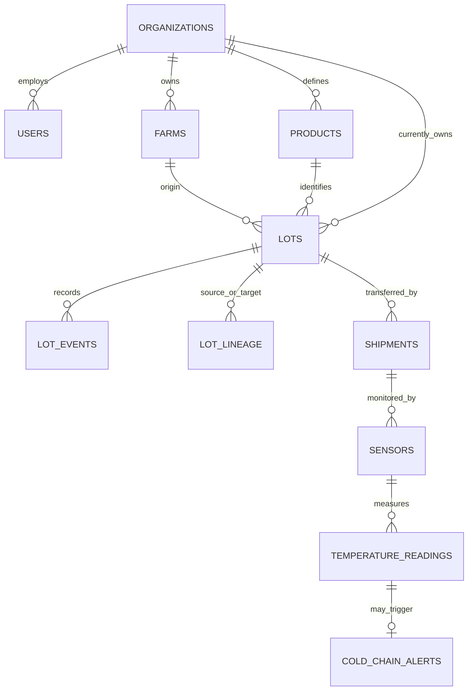

# Database design

PostgreSQL is the source of truth. The schema is a modular relational model: tenant-owned records use UUID keys, explicit foreign keys, checks, uniqueness, and indexes. Alembic migrations are the only schema change path.

## Entity map

## Table responsibilities

| Tables | Purpose and key rules |
|---|---|
| `organizations`, `roles`, `users`, `sessions` | Tenant identity, role assignment, Argon2id password hashes, hashed opaque sessions, login lockout. `users.email` is globally unique and constrained to lower case; `failed_login_attempts` cannot go negative. |
| `farms` | Organization-owned production sites; positive area and latitude/longitude bounds. |
| `products` | Organization-owned catalog and optional minimum/maximum safe temperatures. Check enforces minimum ≤ maximum. |
| `lots` | Current owner, immutable origin organization, origin farm, product, positive quantity, state and random public QR code. Composite FKs ensure farm/product belong to the origin organization. |
| `lot_lineage` | Directed source-to-target edges and allocated source quantity. The API locks source lots and prevents reusing allocated quantity. |
| `lot_events` | Append-only event history; internal JSON details are separate from the public note. |
| `shipments` | One full-lot custody transfer with sender, receiver, state and temperature extrema. A partial unique index prevents two active transfers for one lot. |
| `sensors`, `temperature_readings` | A sensor belongs to the shipment sender; readings must match the sensor, organization and shipment. `(sensor_id, source_reading_id)` makes batch retries idempotent. |
| `cold_chain_alerts` | One alert per out-of-range reading, with resolution actor and timestamp. Composite foreign keys keep the alert tied to that reading, sensor and shipment. |

`lots.organization_id` tracks the current custodian and changes only when a receiver accepts a shipment. `origin_organization_id`, `origin_farm_id`, and `product_id` remain stable so the original provenance survives handoffs.

## Isolation and access

The runtime connects as a **dedicated least-privilege role** (`DB_USER`, default `ttcs_app`) that is
`NOSUPERUSER NOBYPASSRLS NOINHERIT NOCREATEDB NOCREATEROLE NOREPLICATION`, created by
`app.bootstrap_db_role`. `DB_ADMIN_USER` is used only by Alembic and by that bootstrap, and the two must
differ: `app.core.config` refuses to start if they are equal, because the application must never hold a role
that can bypass row-level security.

- Authenticated requests put `app.current_organization`, `app.current_user_id`, `app.current_role`,
  `app.session_token_hash` and `app.login_email` into the active transaction with **transaction-local**
  settings (`set_config(..., is_local = true)`, i.e. `SET LOCAL`). A pooled connection can therefore never
  carry a tenant context into the next request, and `COMMIT`/`ROLLBACK` discards it.
- Row-level security is enabled **and forced** on every tenant table (`farms`, `products`, `lots`,
  `lot_lineage`, `lot_events`, `shipments`, `sensors`, `temperature_readings`, `cold_chain_alerts`,
  `users`, `sessions`). `organizations` and `roles` are global directories and are intentionally not
  tenant-scoped.
- With no tenant context set, every tenant table reads as empty. That is the invariant the integration
  suite asserts, because RLS must fail closed rather than fall open.
- Receiving organizations get access to an in-transit lot through the matching shipment, and can update its
  owner only while accepting that shipment.
- Session and user RLS policies expose the row needed for the current login token or current organization.
  Login sets a normalized email context before looking up a user, and `ck_users_email_normalized` keeps
  stored addresses lower-cased so a mixed-case row can never shadow a real account.
- Cross-tenant access returns `403`. Row-level security hides the foreign row from an ordinary SELECT, so
  `get_tenant_record` asks `app_tenant_record_exists(text, uuid)` — a `SECURITY DEFINER` function with
  `row_security = off`, restricted to a fixed table allowlist, returning only a boolean, revoked from
  `PUBLIC` and granted solely to the runtime role. This is what keeps `403` distinct from `404`.
- Inspection is read-only. `inspector` holds `lots:read_all`, which only widens *reads*; the sensor policy
  was split from a single `FOR ALL` policy into separate read/insert/update policies so no write path can
  be reached through a read-oriented `USING` clause. The blanket inspector read on `farms` was removed,
  because inspection holds no `farms:read` permission.
- Public QR lookup starts from an unguessable public code, walks at most 25 source edges, and supplies only
  the discovered lot IDs to the scoped read policies. Its response omits account IDs, exact farm
  coordinates, internal event details, shipment records, and sensor readings.
- RLS supplements application authorization. API handlers still scope reads and validate each state
  transition. Public notes are intentionally public and must not contain private data.
- Event and lineage rows cannot be updated or deleted by the runtime database role. Corrections should be
  represented by a later event. `lot_events.organization_id` is bound to the lot's owning organization by a
  composite foreign key, so a custody transfer can no longer split one lot's history across two tenants.
- `lot_lineage` carries composite foreign keys from both `source_lot_id` and `target_lot_id` to
  `lots(id, organization_id)`, so a provenance edge cannot cross organizations even for a client holding
  the runtime database role.

## Indexes and growth

Indexes follow the access paths used by the API: tenant plus creation time for products/lots, tenant plus status for lots/alerts, lot plus event time, source/target lot for lineage, sender/receiver plus shipment status, and shipment plus measured time for sensor readings. Foreign keys and unique idempotency keys are database-enforced.

Temperature readings are append-heavy. This MVP keeps them in one indexed table; if volume grows substantially, add time partitioning and a retention/archive policy in a separately planned migration. Do not partition before the workload and retention period are known.

## Migration order

`20260929_01` identity → `20260929_02` farms → `20260929_03` farm RLS and runtime role grants →
`20260929_04` catalog, lots, lineage, events, shipments, cold chain and related RLS →
`20260929_05` tenant-isolation hardening (email normalization, `403` existence probe, sensor policy split,
farms policy tightening, lineage and cold-chain foreign keys, database-level CONNECT lockdown).

Apply with `alembic upgrade head` using the migration database connection, and keep
`alembic check` green: CI fails if the SQLAlchemy models and the migrations disagree.
